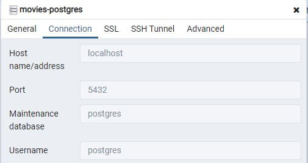
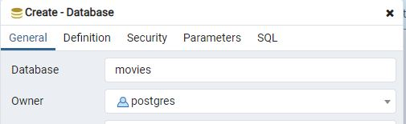

# Movie Recommendations Demo
Spring Boot service demonstration

## Deploying locally

```
mvn clean install
```

### Run application

Run main class `MovieRecommendationApplication.java`.

It is recommended that you run using the h2 file based database - this will be set-up with default data when the service is started.

To run using responses from the h2 database add `--spring.profiles.active=h2`

The h2 database is available at:
http://host-name/h2

### Run application via Maven

Run normally `mvn spring-boot:run`

To run using the h2 database add `mvn spring-boot:run -Dspring-boot.run.profiles=h2`

### Stub responses

To run using stub responses replace 'h2' with 'stub'. This can be useful for testing static responses without a real database.

### Local Postgres Database

To run against a local Postgres database, you must first start a local instance of Postgres. The easiest way is by using Docker.

```
docker run -d
    --name movies-postgres
    -p 5432:5432
    -e POSTGRES_PASSWORD=<my-password>
    -d postgres
```

This will pull the Docker image if needed and then start Postgres on port 5432.

Once started, it is recommended to use pgAdmin to review the database server. Connect to the `movies-postgres` database server using the credentials below:



Create an empty database called `movies` within pgAdmin.



To allow the Movie Recommendations service to connect to the local Postgres database, run with:
```mvn spring-boot:run -Dspring-boot.run.profiles=postgres```

On start-up, the service will populate the database with default data. All API requests will now result in reads from and writes to our local Postgres database.


## Using Application

### Movie Recommendations

Example API calls to service.

Get a list of all recommended movies:
```
http://localhost:8080/api/movies/recommendations
```

Get a list of all recommended movies for a specific genre and/or year:
```
http://localhost:8080/api/movies/recommendations?genre=Sci-Fi&year=1972
```

## Docker

### Build a Docker image

Build JAR and confirm application works locally

```
./mvnw package
java -jar target/movie-recommendations-<version>-SNAPSHOT.jar
```

To build a Docker image, make sure you are running on a machine where Docker is installed.

```
./mvnw install dockerfile:build
```

Check image:
```
docker image ls
```
Should be listed as `springio/movie-recommendations`.

### Run in a Docker container

Run in container:
```
docker run -p 4000:8080 springio/movie-recommendations
```

Internally the service runs on port `8080`. The above command maps port `4000` of the docker machine to the spring boot service.

This allows us to access the application on:

```
http://<docker-machine-ip>:4000/api/movies/health
```

You can obtain the docker machine's IP using:
```
docker-machine ip
```

You can now run any number of containers of this service on this machine as long as each is on a different port (e.g. `4000`, `4001`, `4002`, etc...).

To stop a container:
```
docker container ls
docker container stop <Container NAME or ID>
```

This guide was based on: https://spring.io/guides/gs/spring-boot-docker/

## Deploying to AWS

This application can also be deployed to Amazon Web Services (AWS) and run within multiple containers as part of a cluster.

Please read the specially written guide: [Deploying to Amazon Web Services (AWS)](./aws).


